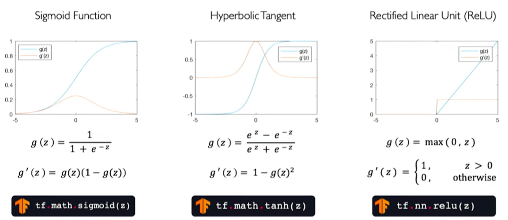
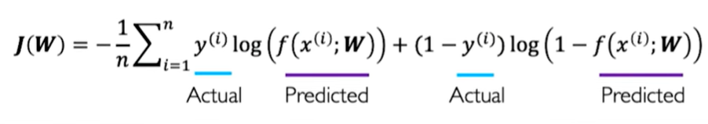
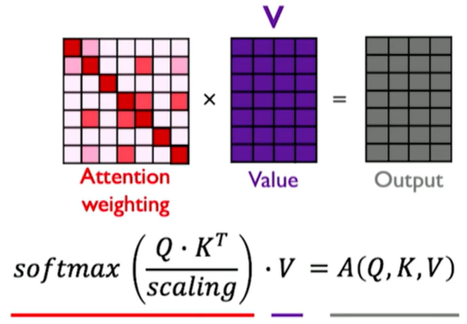
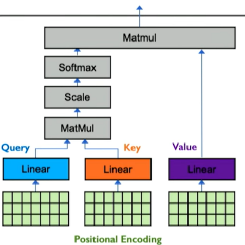
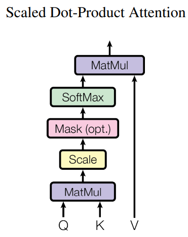

## <font big color=#ED4557>Intro </font>  
#### 1. The perceptron: forward propagation
- Structural building blocks
- Nonlinear activation functions
#### 2. Neural Networks
- Stacking Perceptrons to form neural networks
- Optimization through backpagation
#### 3. Training in Practice
- Adaptive learning
- Batching
- Regularization

<div align=left></div>  
```python
# Dense layer from scratch
class MyDenseLayer(tf.keras.layers.Layer):
  def _init_(self, input_dim, output_dim):
    super(MyDenseLayer, self)._int_()

    # Initialize weights and bias
    self.W = self.add_weight([input_dim, output_dim])
    self.b = self.add_weight([1, output_dim])

    def call(self, inputs):
      # Forward propagate the inputs
      z = tf.matmul(inputs, self.W) + self.b

      # Feed through a non-linear activation
      output = tf.math.sigmoid(z)

      return output
```

-  <font big color=green>Multi Output Perceptron: </font>
```python
import tensorflow as tf
model = tf.keras.Sequential([tf.keras.layers.Dense(n), tf.keras.layers.Dense(2)])
```
-  <font big color=green>Binary Cross Entropy Loss  </font>
`loss =  tf.reduce_mean(tf.nn.softmax_cross_entropy_with_logits(y, predicted))`
 &emsp; <div align=left></div>  

 -  <font big color=green>Mean Squared Error Loss  </font>
 $ J(W) = \frac{1}{n} \sum^{n}_{i=1} (y^(i)-f(x^(i);W))^2$
 ```python
 loss = tf.reduce_mean(tf.square(tf.subtract(y, predicted)))
 loss = tf.keras.losses.MSE( y, predicted )
 ```
##### Gradient Descent  
```python
import tensor flow as tf

weights = tf.Variable([tf.random.normal()])

while True:     # loop forever
  with tf.GradientTape( ) as g:
    loss = compute_loss(weights)
    gradient = g.gradient(loss, weights)

  weights = wights -lr *gradient
```
**Gradient Descent Algorithm:**  
- SGD `tf.keras.optimizers.SGD`  
- Adam `tf.keras.optimizers.Adam`  
- Adadelta `tf.keras.optimizers.Adadelta`   
- Adagrad `tf.keras.optimizers.Adagrad`  
- RMSProp `tf.keras.optimizers.RMSProp`  
[References:](http://ruder.io/optimizing-gradient-descent/)
[1] [Stochastic Estimation of the Maximum of a Regression Function](https://www.jstor.org/stable/2236690)
[2] [Adam: A Method for Stochastic Optimization](https://arxiv.org/abs/1412.6980)
[3] [ADADELTA: An Adaptive Learning Rate Method](https://arxiv.org/abs/1212.5701)
[4] [Adaptive Subgradient Methods for Online Learning and Stochastic Optimization](https://www.jmlr.org/papers/volume12/duchi11a/duchi11a.pdf)

```python
# Putting it all together  
import tensorflow as tf
model = tf.keras.Sequential([...])
optimizer = tf.keras.optimizer.SGD()

while True:  # loop forever
  # forward pass through the network
  prediction = model(x)
  with tf.GradientTape() as tape:
    # compute the loss
    loss = compute_loss(y, prediction)
  # update the weights using the Gradient
  grads = tape.gradient(loss, model.trainable_variables)
  optimizer.apply_gradients(zip(grads, model.trainable_variables))
```

**Regularization 1: Dropout**  
`tf.keras.layer.Dropout(p=05)`

&emsp;
&emsp;
&emsp;


## <font big color=#ED4557>Recurrent Neural Networks and Transformers </font>  
`tf.keras.layers.SimpleRNN(run_units)`

```python
class MyRNNCell(tf.keras.layers.Layer):
  def _init_(self, rnn_units, input_dim, output_dim):
    super(MyRNNCell, self)._init_()

    # Initialize weight matrices
    self.W_xh = self.add_weight([rnn_units, input_dim])
    self.W_hh = self.add_weight([rnn_units, runn_units])
    self.W_hy = self.add_weight([output_dim, rnn_units])

    # Initialize hidden state to zeros
    self.h = tf.zeros([rnn_units, 1])

  def call(self, x):
    # Update the hidden state
    self.h = tf.math.tanh( self.W_hh + self.h + self.W_xh * x )

    # Compute the output
    output = self.W_hy * self.h

    # Return the current output and hidden state
    return output, self.h
```
**Long Short Term Memory (LSTMs)**
&emsp;   1) Forget &emsp;   2) Store &emsp;  3) Update &emsp;  4) Output  
`tf.keras.layers.LSTM(num_units)`
`loss = tf.nn.softmax_cross_entropy_with_logits(y, predicted)`  

**Self-Attention:**  &emsp;    <font  color=green>(query, key, value) </font>
<div align=left>  &emsp; &emsp; &emsp; &emsp;   </div>  

&emsp;  
&emsp;  
<font  color=purple>Language Processing</font> &emsp;  [BERT: Pre-training of Deep Bidirectional Transformers for Language Understanding](https://arxiv.org/abs/1810.04805)
 &emsp;   &emsp;   &emsp;   &emsp;   &emsp;   &emsp;   &emsp;   &emsp;   &emsp;          [Language Models are Few-Shot Learners](https://proceedings.neurips.cc/paper/2020/hash/1457c0d6bfcb4967418bfb8ac142f64a-Abstract.html)  
 <font  color=purple>Biological Sequences</font> &emsp; [Highly accurate protein structure prediction with AlphaFold](https://www.nature.com/articles/s41586-021-03819-2)  
  <font  color=purple>Computer Vision</font> &emsp; [An Image is Worth 16x16 Words: Transformers for Image Recognition at Scale](https://arxiv.org/abs/2010.11929)


  &emsp;
  &emsp;
  &emsp;


## <font big color=#ED4557>Attention is All you Need</font>   [*](https://proceedings.neurips.cc/paper/2017/hash/3f5ee243547dee91fbd053c1c4a845aa-Abstract.html)  
 #### Model Architecture  
 ##### 3.1 Encoder and Decoder Stacks  
 ##### 3.2 Attention
 ###### 3.2.1 Scaled Dot-Product Attention
 ###### 3.2.2 Multi-Head Attention
 ###### 3.2.3 Applications of Attention in our Model
 ##### 3.3 Position-wise Feed-Forward Networks
 ##### 3.4 Embeddings and Softmax
 ##### 3.5 Positional Encoding
#### Training  
##### 5.1 Training Data and Batching
##### 5.2 Hardware and Schedule
##### 5.3 Optimizer
##### 5.4 Regularization
###### Residual Dropout
###### Label Smoothing
<div align=left> </div>  

>From other Vision Transformer(VIT) lectures:
1.Encoding is important but no need for 2 more dimensions unless they have specific meanings.
2.One more token for output.
3.TNT: Transformer in Transformer. -Patch position encoding, -Pixel position encoding.

[pytorch implementation](https://wmathor.com/index.php/archives/1455/) - Very detailed explanation of the code in Chinese, the author is still in school. :D  


  &emsp;
  &emsp;
  &emsp;


## <font big color=#ED4557>PDE</font>   [*](https://proceedings.neurips.cc/paper/2017/hash/3f5ee243547dee91fbd053c1c4a845aa-Abstract.html)  
